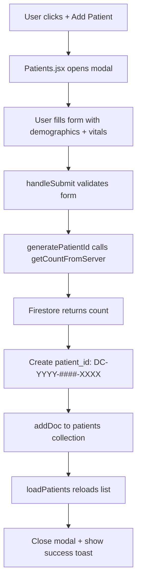
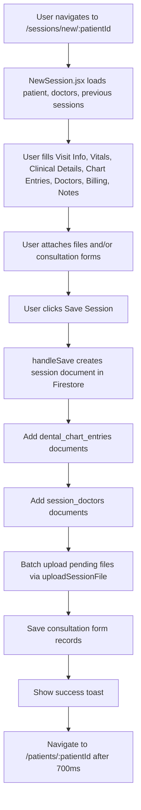
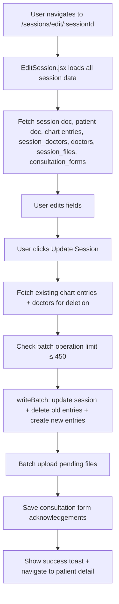
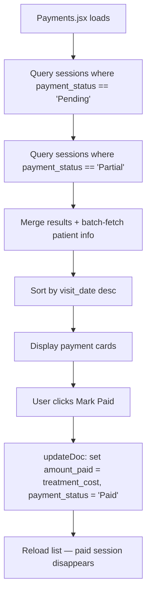
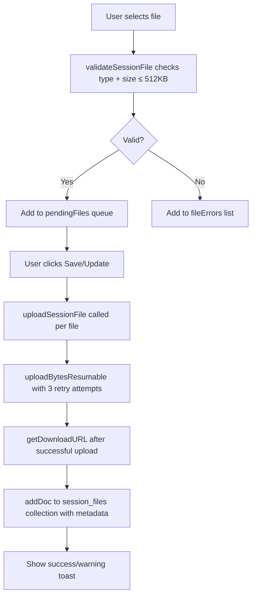
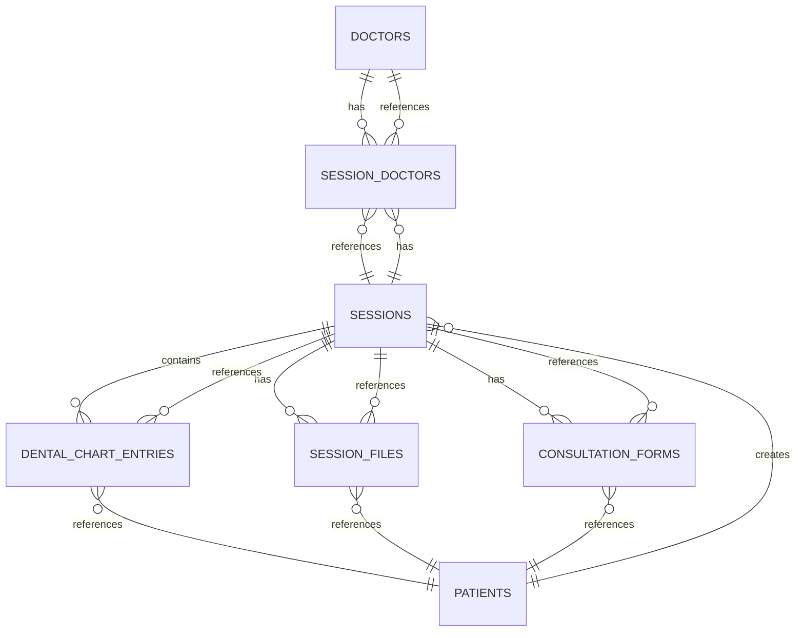
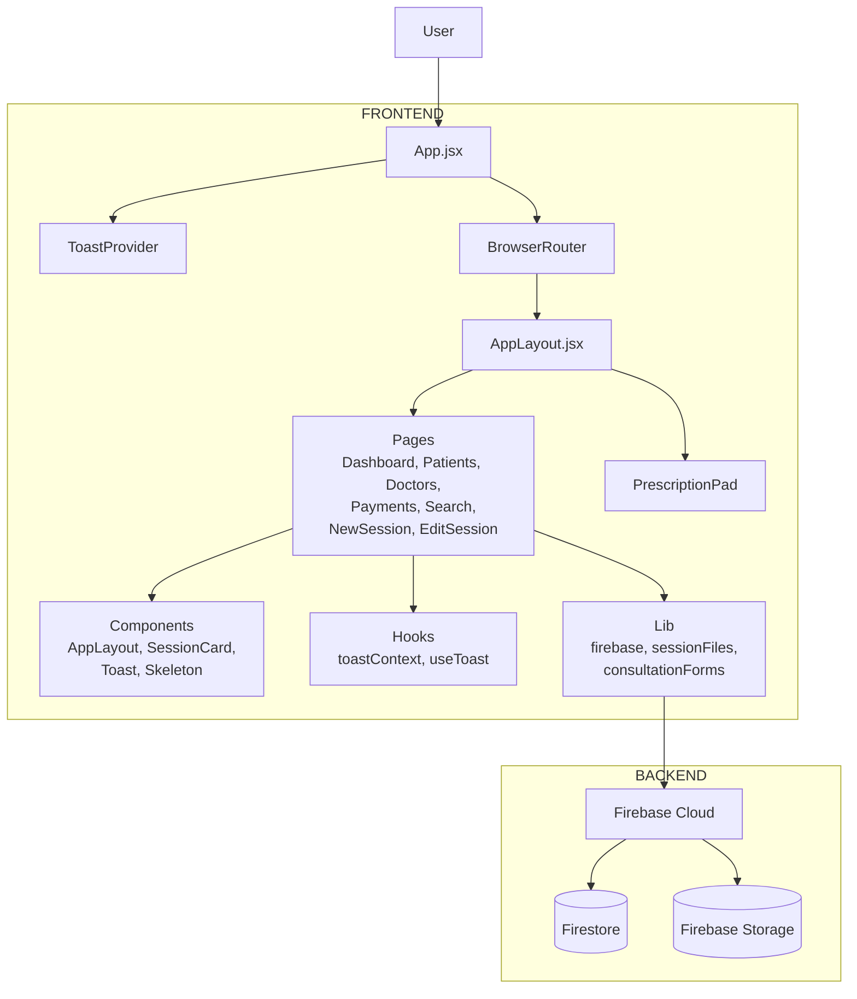
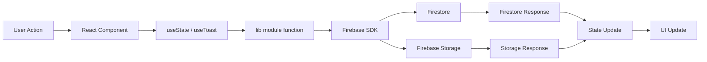
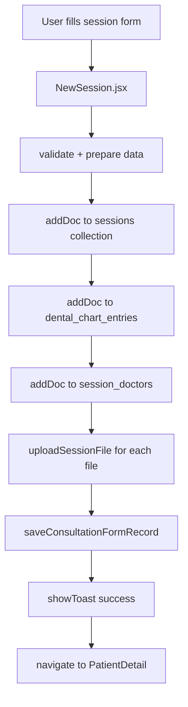

# 🦷 DentaRecord — Dental Clinic Management System

**DentaRecord** is a full-featured, chairside dental clinic management application built with **React 19**, **Firebase**, and **Tailwind CSS v4**. It provides patient registration, session-based clinical record keeping, dental charting, doctor management, payment tracking, file attachments, vital sign recording, consultation form management, global patient search, and a standalone prescription pad — all within a responsive sidebar-driven layout.

---

## Table of Contents

- [Source of Truth](#source-of-truth)
- [Executive Summary](#executive-summary)
- [System Overview](#system-overview)
- [Technology Stack](#technology-stack)
- [Repository Structure](#repository-structure)
- [Application Architecture](#application-architecture)
- [Frontend Architecture](#frontend-architecture)
- [Backend Architecture](#backend-architecture)
- [Component Architecture](#component-architecture)
- [Shared Components](#shared-components)
- [API Inventory](#api-inventory)
- [Data Flow](#data-flow)
- [Database Architecture](#database-architecture)
- [Database Schema Availability](#database-schema-availability)
- [Authentication & Authorization](#authentication--authorization)
- [File & Storage Architecture](#file--storage-architecture)
- [External Integrations](#external-integrations)
- [Application-to-Application Connections](#application-to-application-connections)
- [Configuration & Environment Variables](#configuration--environment-variables)
- [Deployment Architecture](#deployment-architecture)
- [CI/CD](#cicd)
- [Testing Architecture](#testing-architecture)
- [Feature Architecture](#feature-architecture)
- [Dependency Architecture](#dependency-architecture)
- [Important Files](#important-files)
- [Responsibility Map](#responsibility-map)
- [Architecture Diagrams](#architecture-diagrams)
- [Documentation Audit](#documentation-audit)
- [Architectural Risks](#architectural-risks)
- [Unknown / Missing Information](#unknown--missing-information)
- [AI Development Context](#ai-development-context)
- [Rules for Safely Modifying the Codebase](#rules-for-safely-modifying-the-codebase)
- [Change Impact Guide](#change-impact-guide)
- [Architecture Confidence](#architecture-confidence)

---

## Source of Truth

Architecture documentation generated from repository source code.

**Source of truth hierarchy:**

1. Executable source code (`src/` directory)
2. Configuration (`package.json`, `vite.config.js`, `.env`)
3. Database/schema definitions (`firestore.rules`, `storage.rules`, `firestore-collections.md`)
4. API definitions (Firebase Firestore + Storage — no REST server)
5. Tests (NONE FOUND — no test files exist)
6. Existing documentation (`README.md`, `firestore-collections.md`, `presciption pad.md`)
7. Comments (source code comments are minimal)

**IMPORTANT**: The `.env` file contains credentials for CockroachDB and Cloudflare R2 that are **NOT used anywhere in the source code**. The application exclusively uses Firebase. These are legacy or planned-for-future credentials.

---

## Executive Summary

DentaRecord is a single-page application (SPA) that serves as a complete dental clinic management system. The application has **no custom backend server** — it relies entirely on **Firebase** (Firestore for the database and Storage for file uploads) as its backend-as-a-service layer. The frontend is a React 19 application using Vite as the build tool and Tailwind CSS v4 for styling.

Key characteristics:
- **Zero authentication** — Firestore rules allow all read/write (development-only configuration)
- **No server-side code** — all "backend" logic is through Firebase services
- **No relational database** — Firestore is NoSQL document-based
- **Standalone prescription pad** — a separate route for generating A4 PDF prescriptions
- **9 pages + 4 shared components + 2 hooks + 3 lib modules**
- **7 Firestore collections** (doctors, patients, sessions, session_doctors, dental_chart_entries, session_files, consultation_forms)

---

## System Overview

```
┌─────────────────────────────────────────────────────────────────────────┐
│                          index.html                                       │
│                    <div id="root"></div>                                 │
└──────────────────────────┬──────────────────────────────────────────────┘
                           │
                    ┌──────▼──────┐
                    │  main.jsx   │   React 19 createRoot + StrictMode
                    └──────┬──────┘
                           │
                    ┌──────▼──────┐
                    │   App.jsx   │   ToastProvider → BrowserRouter → Routes
                    └──────┬──────┘
                           │
              ┌────────────▼────────────┐
              │      AppLayout.jsx      │   Persistent sidebar + header
              │  ┌──────────────────┐   │
              │  │    <Outlet />    │   │   Page content renders here
              │  └──────────────────┘   │
              └─────────────────────────┘
                           │
         ┌─────────────────┼─────────────────────┐
         │                 │                     │
    ┌────▼────┐      ┌─────▼──────┐      ┌─────▼──────┐
    │  Pages  │      │ Components │      │   Hooks    │
    │ (9 JSX) │      │  (4 shared)│      │  (2 files) │
    └────┬────┘      └─────┬──────┘      └─────┬──────┘
         │                 │                     │
         └─────────────────┼─────────────────────┘
                           │
              ┌────────────▼────────────┐
              │     lib/firebase.js     │   Firebase app init, Firestore + Storage
              └────────────┬────────────┘
                           │
              ┌────────────▼────────────┐
              │     lib/sessionFiles.js │   Upload/delete/validate session files
              └────────────┬────────────┘
                           │
              ┌────────────▼────────────┐
              │ lib/consultationForms   │   Form definitions + validation
              └────────────┬────────────┘
                           │
              ┌────────────▼────────────┐
              │lib/consultationFormRec. │   Consultation form record operations
              └────────────┬────────────┘
                           │
              ┌────────────▼────────────┐
              │  lib/config.js          │   Clinic branding constants
              └────────────┬────────────┘
                           │
              ┌────────────▼────────────┐
              │    Firebase Cloud       │
              │  ┌─────────────────┐    │
              │  │   Firestore DB  │    │   7 collections
              │  ├─────────────────┤    │
              │  │ Firebase Storage│    │   File uploads (≤512KB)
              │  └─────────────────┘    │
              └─────────────────────────┘
```

---

## Technology Stack

| Category | Technology | Details |
|----------|-----------|---------|
| **Framework** | React 19 | Functional components, hooks, JSX |
| **Build Tool** | Vite 8 | With `@vitejs/plugin-react` and `@tailwindcss/vite` |
| **Styling** | Tailwind CSS v4 | Via `@tailwindcss/vite` plugin |
| **Routing** | React Router DOM v6 | Nested `<Routes>`, `<Outlet>`, `<NavLink>`, `<useParams>` |
| **Database** | Firebase Firestore | NoSQL document-based, 7 collections |
| **File Storage** | Firebase Storage | Resumable uploads, ≤512KB per file |
| **Icons** | lucide-react | 50+ icons used across the app |
| **Date Utility** | date-fns v4 | `format`, `parseISO` |
| **PDF Generation** | jsPDF v4 + html2canvas v1 | PrescriptionPad only — standalone A4 PDF generation |
| **Linting** | ESLint flat config | `eslint-plugin-react-hooks`, `eslint-plugin-react-refresh` |
| **Runtime** | Node.js (npm) | `npm run dev`, `npm run build` |
| **Auth** | NONE | No authentication mechanism implemented |
| **State Management** | React Context + useState | ToastContext for notifications; all other state is local |
| **CSS** | Tailwind CSS v4 + App.css | `App.css` is legacy Vite template (unused by app) |

---

## Repository Structure

```
mamta dental/
├── .env                          # Firebase + CockroachDB + R2 credentials (gitignored)
├── .gitignore                    # Ignore rules for node_modules, dist, .env
├── eslint.config.js              # ESLint flat config with React plugins
├── firestore-collections.md      # Firestore schema reference document
├── firestore.rules               # Firestore security rules (ALLOW ALL — dev only)
├── index.html                    # HTML entry point with <div id="root">
├── package.json                  # Dependencies, scripts
├── package-lock.json             # Lock file
├── storage.rules                 # Firebase Storage security rules
├── vercel.json                   # Vercel deployment config (rewrites to /)
├── vite.config.js                # Vite config with React + Tailwind plugins
├── public/
│   ├── favicon.svg               # Browser tab icon (tooth icon)
│   ├── icons.svg                 # SVG sprite sheet for UI icons
│   ├── logo.jpeg                 # Clinic logo (used in PrescriptionPad)
│   └── consultation-forms/       # 8 PDF consultation forms
│       ├── endodontic-surgery.pdf
│       ├── esthetic-procedures.pdf
│       ├── post-endodontic-restorations.pdf
│       ├── restoration.pdf
│       ├── root-canal-treatment.pdf
│       ├── tooth-extraction.pdf
│       ├── Clear_Periodontics_Scaling_Root_Planing_Consent_Form.pdf
│       └── Periodontics_Consent_Form.pdf.pdf
├── src/
│   ├── main.jsx                  # App bootstrap — React 19 createRoot + StrictMode
│   ├── App.jsx                   # Root component — ToastProvider → Router → Routes
│   ├── App.css                   # Legacy Vite template styles (UNUSED by app)
│   ├── index.css                 # Global styles — Tailwind import, font, bg color
│   ├── assets/
│   │   ├── hero.png              # Decorative hero image
│   │   ├── react.svg             # React logo
│   │   └── vite.svg              # Vite logo
│   ├── components/
│   │   ├── AppLayout.jsx         # Sidebar + header + <Outlet> shell (4 sub-components)
│   │   ├── SessionCard.jsx       # Visit/session display card (376 lines)
│   │   ├── Skeleton.jsx          # Animated loading placeholder
│   │   └── Toast.jsx             # Toast notification provider + renderer
│   ├── hooks/
│   │   ├── toastContext.js       # React context for toast system
│   │   └── useToast.js           # Custom hook to access showToast/dismissToast
│   ├── lib/
│   │   ├── config.js             # Clinic name/subtitle branding constants
│   │   ├── firebase.js           # Firebase app init, Firestore + Storage exports
│   │   ├── sessionFiles.js       # Upload/delete/validate helpers for session documents
│   │   ├── consultationForms.js  # Consultation form definitions + validation
│   │   └── consultationFormRecords.js # Consultation form record CRUD operations
│   ├── pages/
│   │   ├── Dashboard.jsx         # Overview stats, upcoming appointments, recent patients
│   │   ├── Patients.jsx          # Patient list, search, registration modal
│   │   ├── PatientDetail.jsx     # Patient profile + visit history timeline
│   │   ├── EditPatient.jsx       # Edit patient demographics + medical history
│   │   ├── Doctors.jsx           # Doctor CRUD table with active/inactive toggle
│   │   ├── Payments.jsx          # Outstanding payment tracker with mark-as-paid
│   │   ├── Search.jsx            # Global patient search with last visit summary
│   │   ├── NewSession.jsx        # Multi-section session creation form (1296 lines)
│   │   ├── EditSession.jsx       # Edit existing session with delete option
│   │   └── PrescriptionPad.jsx   # Standalone A4 prescription/PDF generator
│   └── utils/                    # (Reserved — currently empty)
├── repomix-output.xml            # Repomix-packed repository representation
└── presciption pad.md            # Prescription pad documentation
```

### Why Each Directory Exists

- **`src/components/`**: Shared, reusable UI components used across multiple pages
- **`src/hooks/`**: React context and custom hooks for cross-component state (toast notifications)
- **`src/lib/`**: Library modules — Firebase initialization, file upload logic, consultation form definitions, configuration constants
- **`src/pages/`**: Page-level components, each corresponding to a route in the application
- **`src/utils/`**: Reserved for future utility functions (currently empty)
- **`public/`**: Static assets served directly by Vite — icons, logos, and PDF consultation forms
- **`public/consultation-forms/`**: PDF files for dental consultation consent forms

---

## Application Architecture

The application follows a **client-only architecture** with no custom backend server. All data persistence and file storage is handled through Firebase services.

```
User
↓
Browser (React SPA)
↓
React Component (Page)
↓
Custom Hook (useToast) / Local State (useState)
↓
Firebase SDK (firebase.js)
↓
Firestore (CRUD operations) OR Storage (file uploads)
```

**No backend server exists.** All "API calls" are direct Firebase SDK invocations from the browser.

---

## Frontend Architecture

### Application Entry Point

```
index.html → <div id="root"> → main.jsx → createRoot(<App />)
```

### Routing Architecture

All routes are nested inside `<AppLayout>`, which provides the persistent sidebar and header. The `<PrescriptionPad>` route is **outside** `<AppLayout>` (it has its own toolbar).

| Route Pattern | Page Component | Description |
|--------------|---------------|-------------|
| `/` or `/dashboard` | `Dashboard` | Home — stats, appointments, patients |
| `/patients` | `Patients` | Patient list + registration |
| `/patients/:patientId` | `PatientDetail` | Patient profile + visit history |
| `/patients/:patientId/edit` | `EditPatient` | Edit patient record |
| `/doctors` | `Doctors` | Doctor management table |
| `/payments` | `Payments` | Outstanding payment tracker |
| `/search` | `Search` | Global patient search |
| `/sessions/new` | `NewSession` | Create session (no patient pre-selected) |
| `/sessions/new/:patientId` | `NewSession` | Create session for specific patient |
| `/sessions/edit/:sessionId` | `EditSession` | Edit an existing session |
| `/prescription/:doctorId` | `PrescriptionPad` | Standalone prescription PDF generator |
| `*` | → Redirects to `/` | Unknown routes redirect to home |

### Page Hierarchy

```
App.jsx
├── ToastProvider
└── BrowserRouter
    ├── Routes
    │   ├── Route (element=AppLayout)
    │   │   ├── / → Dashboard
    │   │   ├── /dashboard → Dashboard
    │   │   ├── /patients → Patients
    │   │   ├── /patients/:patientId → PatientDetail
    │   │   ├── /patients/:patientId/edit → EditPatient
    │   │   ├── /doctors → Doctors
    │   │   ├── /payments → Payments
    │   │   ├── /search → Search
    │   │   ├── /sessions/new → NewSession
    │   │   ├── /sessions/new/:patientId → NewSession
    │   │   └── /sessions/edit/:sessionId → EditSession
    │   ├── /prescription/:doctorId → PrescriptionPad
    │   └── * → Navigate to /
```

### Providers & Context

| Context | File | Purpose |
|---------|------|---------|
| `ToastContext` | `src/hooks/toastContext.js` | Global toast notification system (showToast, dismissToast) |
| `ToastProvider` | `src/components/Toast.jsx` | Provides toast state and methods to all children |

### State Management

- **Toast notifications**: React Context (`ToastContext`) + `useToast()` hook
- **All other state**: Local `useState` within each page component
- **No global state management library** (no Redux, Zustand, etc.)
- **No URL state management** beyond React Router params

### Data Fetching Strategy

All data is fetched directly from Firestore using the Firebase SDK:
- `getDocs()` for collection queries
- `getDoc()` for single document reads
- `getCountFromServer()` for server-side counting
- `addDoc()` for creating documents
- `updateDoc()` for updating documents
- `deleteDoc()` for deleting documents
- `writeBatch()` for atomic multi-document operations
- `query()` + `where()` for filtered queries
- `orderBy()` + `limit()` for sorted/paginated queries

### API Client Architecture

There is **no separate API client layer**. All Firebase operations are done directly in the page components and lib modules:

```
Page Component
↓ (direct import)
lib/firebase.js → { db, storage, app }
↓
firestore/firestore imports (addDoc, getDocs, etc.)
OR
firebase/storage imports (uploadBytesResumable, getDownloadURL, etc.)
```

### Data Flow Pattern

```
User Action
↓
UI Component (event handler)
↓
Page Component State (useState)
↓
lib/module function (sessionFiles.js, consultationFormRecords.js)
↓
Firebase SDK (firebase.js)
↓
Firestore or Storage
↓
Response → State Update → UI Re-render
```

### File-level Architecture Map

| File | Responsibility | Criticality |
|------|---------------|-------------|
| `src/main.jsx` | Application bootstrap | HIGH |
| `src/App.jsx` | Root routing, providers | HIGH |
| `src/lib/firebase.js` | Firebase initialization, db & storage exports | HIGH |
| `src/lib/sessionFiles.js` | Session file upload/delete/validate | HIGH |
| `src/lib/consultationFormRecords.js` | Consultation form CRUD | HIGH |
| `src/lib/consultationForms.js` | Consultation form definitions | MEDIUM |
| `src/lib/config.js` | Clinic branding constants | MEDIUM |
| `src/components/AppLayout.jsx` | Sidebar navigation, header, layout | HIGH |
| `src/components/SessionCard.jsx` | Session display component | HIGH |
| `src/components/Toast.jsx` | Toast notification system | MEDIUM |
| `src/components/Skeleton.jsx` | Loading placeholder | LOW |
| `src/hooks/toastContext.js` | Toast context definition | MEDIUM |
| `src/hooks/useToast.js` | Toast hook | MEDIUM |
| `src/pages/Dashboard.jsx` | Dashboard overview | HIGH |
| `src/pages/Patients.jsx` | Patient registration & list | HIGH |
| `src/pages/PatientDetail.jsx` | Patient profile & history | HIGH |
| `src/pages/EditPatient.jsx` | Patient editing | HIGH |
| `src/pages/Doctors.jsx` | Doctor management | HIGH |
| `src/pages/Payments.jsx` | Payment tracking | HIGH |
| `src/pages/Search.jsx` | Global search | MEDIUM |
| `src/pages/NewSession.jsx` | Session creation (most complex) | HIGH |
| `src/pages/EditSession.jsx` | Session editing | HIGH |
| `src/pages/PrescriptionPad.jsx` | Standalone PDF prescription generator | MEDIUM |

---

## Backend Architecture

**There is no custom backend server.** The backend consists entirely of Firebase services:

### Firebase Services Used

| Service | Purpose | SDK Import |
|---------|---------|-----------|
| **Firestore** | All data persistence (patients, sessions, doctors, files, forms) | `getFirestore`, `firebase/firestore` |
| **Storage** | File uploads (X-rays, reports, prescriptions, signatures) | `getStorage`, `firebase/storage` |
| **Firebase App** | Application initialization | `initializeApp`, `firebase/app` |

### Firestore Collections (7 total)

| Collection | Document Structure | Relationship |
|-----------|-------------------|-------------|
| `doctors` | Doctor profile (name, specialty, qualification, phone, email, is_active) | Referenced by `session_doctors` |
| `patients` | Patient demographics + vitals + medical history | Referenced by `sessions` via `patient_id` |
| `sessions` | Clinical session (visit info, vitals, billing, treatment) | Referenced by `session_doctors`, `dental_chart_entries`, `session_files`, `consultation_forms` |
| `session_doctors` | Links sessions to doctors (session_id, doctor_id) | Junction table |
| `dental_chart_entries` | Tooth/region procedures per session (session_id, region, tooth_number, procedure_done) | Child of session |
| `session_files` | Uploaded document metadata (session_id, patient_id, file_name, storage_path, download_url) | Child of session |
| `consultation_forms` | Consultation form acknowledgements (session_id, patient_id, form_type, form_label, signature_url) | Child of session |

### Firestore Security Rules

```javascript
// firestore.rules — ALLOW READ/WRITE FOR ALL (development only!)
rules_version = '2';
service cloud.firestore {
  match /databases/{database}/documents {
    match /{document=**} {
      allow read, write: if true;
    }
  }
}
```

**CRITICAL**: These rules allow **anyone** to read and write all data. This is a development-only configuration and must NOT be used in production.

### Storage Security Rules

```javascript
// storage.rules — Two path patterns with size and content type restrictions
match /patients/{patientId}/sessions/{sessionId}/{fileName} {
  allow read: if true;
  allow write: if request.resource.size < 512000 && request.resource.contentType.matches('application/pdf|image/jpeg|image/png');
  allow delete: if true;
}
match /patients/{patientId}/sessions/{sessionId}/consultation_forms/{fileName} {
  allow read: if true;
  allow write: if request.resource.size < 512000 && request.resource.contentType.matches('image/jpeg|image/png');
  allow delete: if true;
}
```

---

## Component Architecture

### Shared Components

| Component | Location | Purpose | Consumers |
|-----------|----------|---------|-----------|
| `AppLayout` | `src/components/AppLayout.jsx` | Sidebar + header + `<Outlet>` shell | All pages (except PrescriptionPad) |
| `SessionCard` | `src/components/SessionCard.jsx` | Displays a clinical session with vitals, chart entries, files, consultation forms | `PatientDetail.jsx`, `Dashboard.jsx` |
| `Skeleton` | `src/components/Skeleton.jsx` | Animated loading placeholder | All pages (loading states) |
| `Toast` | `src/components/Toast.jsx` | Toast notification provider + renderer | App root (wraps all pages) |

### AppLayout Sub-components

| Sub-component | Purpose |
|---------------|---------|
| `SidebarContent` | Logo + navigation links + consultation forms + prescription pads |
| `SidebarNav` | Navigation items with active state, icons, and tooltips |
| `Logo` | Clinic name branding (collapsible/expanded) |
| `AppLayout` (main) | Mobile sidebar overlay, desktop sidebar, header with page title, `<Outlet>` |

### SessionCard Sub-components

| Sub-component | Purpose |
|---------------|---------|
| `SessionCard` (main) | Full session display with vitals, chart entries, files, consultation forms |
| `Badge` | Colored status badge (visit type, payment status) |
| `formatDate` | Date formatting utility |
| `formatMoney` | Currency formatting utility |
| `isDifferentDateTime` | Check if record was updated |

---

## Shared Components Detail

### AppLayout (`src/components/AppLayout.jsx`)

**Purpose**: Provides the persistent sidebar navigation and header layout that wraps all main application pages.

**Navigation Items**:
- Dashboard (`/`)
- Patients (`/patients`)
- Doctors (`/doctors`)
- Payments (`/payments`)
- Consultation forms (PDF links from `public/consultation-forms/`)
- Prescription pads (Dr. Ashok, Dr. Mamta)

**Features**:
- Collapsible sidebar (desktop: 60px/240px, mobile: overlay)
- Dynamic page title based on route
- Mobile sidebar with backdrop overlay
- Consultation forms sidebar section with 8 PDF links
- Prescription pad sidebar section

**Consumers**: All pages except `PrescriptionPad`

### SessionCard (`src/components/SessionCard.jsx`)

**Purpose**: Displays a complete clinical session record including vitals, dental chart entries, attached documents, and consultation forms.

**Props**: `session`, `followupSession`, `onEdit`, `onDeleteFile`

**Features**:
- Visit type badge (New/Follow-up/Emergency/Routine Checkup)
- Vital signs display (age, weight, BP, sugar, pulse, SPO2)
- Dental chart entries with region/tooth/procedure
- Attached documents with open/delete
- Consultation forms with signature preview modal
- Payment status badge
- Next appointment date
- Edit button

**Consumers**: `PatientDetail.jsx`, `Dashboard.jsx`

---

## API Inventory

This application has **no REST APIs**. All data operations are through Firebase SDK directly. Below is an inventory of all Firestore and Storage operations.

### Firestore Operations

| Operation | Collection | Code Location | Purpose |
|-----------|-----------|---------------|---------|
| `getCountFromServer` | `patients` | Dashboard.jsx, Patients.jsx | Count total patients |
| `getDocs` + `query` | `patients` | Patients.jsx, Search.jsx, Dashboard.jsx | List/filter patients |
| `addDoc` | `patients` | Patients.jsx | Create new patient |
| `getDoc` | `patients` | PatientDetail.jsx, EditPatient.jsx, NewSession.jsx | Read single patient |
| `updateDoc` | `patients` | EditPatient.jsx | Update patient record |
| `getDocs` + `query` | `sessions` | Dashboard.jsx, PatientDetail.jsx, Payments.jsx, NewSession.jsx | Query sessions |
| `addDoc` | `sessions` | NewSession.jsx | Create new session |
| `updateDoc` | `sessions` | EditSession.jsx, Payments.jsx | Update session |
| `writeBatch` (delete) | `sessions` | EditSession.jsx | Delete session + children |
| `getDocs` + `query` | `doctors` | Doctors.jsx, NewSession.jsx | List/filter doctors |
| `addDoc` | `doctors` | Doctors.jsx | Create new doctor |
| `updateDoc` | `doctors` | Doctors.jsx | Update doctor |
| `deleteDoc` | `doctors` | Doctors.jsx | Delete doctor |
| `getDocs` + `query` | `session_doctors` | PatientDetail.jsx, EditSession.jsx | Get doctors for a session |
| `addDoc` | `session_doctors` | NewSession.jsx | Link doctor to session |
| `writeBatch` (delete) | `session_doctors` | EditSession.jsx | Remove doctor links |
| `getDocs` + `query` | `dental_chart_entries` | PatientDetail.jsx, NewSession.jsx, EditSession.jsx | Get chart entries for session |
| `addDoc` | `dental_chart_entries` | NewSession.jsx | Add chart entry |
| `writeBatch` (delete+create) | `dental_chart_entries` | EditSession.jsx | Replace chart entries atomically |
| `getDocs` + `query` | `session_files` | PatientDetail.jsx, EditSession.jsx | Get files for session |
| `addDoc` | `session_files` | sessionFiles.js | Record file metadata |
| `deleteDoc` | `session_files` | sessionFiles.js | Delete file metadata |
| `getDocs` + `query` | `consultation_forms` | consultationFormRecords.js, EditSession.jsx | Get forms for session |
| `addDoc` | `consultation_forms` | consultationFormRecords.js | Save consultation form record |
| `deleteDoc` | `consultation_forms` | consultationFormRecords.js, EditSession.jsx | Delete consultation form |
| `where('__name__', 'in', ...)` | `doctors`, `patients`, `sessions` | PatientDetail.jsx, Dashboard.jsx, Payments.jsx, Search.jsx | Batch document lookups (chunked at 30) |

### Storage Operations

| Operation | Code Location | Purpose |
|-----------|--------------|---------|
| `uploadBytesResumable` | `sessionFiles.js`, `consultationFormRecords.js` | Resumable file upload with retry |
| `getDownloadURL` | `sessionFiles.js`, `consultationFormRecords.js` | Get file download URL |
| `deleteObject` | `sessionFiles.js` | Delete file from storage |

### Consultation Form Operations

| Operation | Code Location | Purpose |
|-----------|--------------|---------|
| `saveConsultationFormRecord` | `consultationFormRecords.js` | Save consultation acknowledgment |
| `getConsultationFormsForSession` | `consultationFormRecords.js` | Get forms for a session |
| `deleteConsultationFormRecord` | `consultationFormRecords.js`, `EditSession.jsx` | Delete form record |

### No Backend Server

**CONFIRMED**: There is no Node.js/Express, Python/Django, Go, or any other custom backend server in this repository. All data operations go directly to Firebase from the browser.

---

## Data Flow

### Patient Registration Flow



### Session Creation Flow



### Session Edit Flow



### Payment Flow



### File Upload Flow



---

## Database Architecture

### Firestore Database Schema

The application uses **Firebase Firestore**, a NoSQL document database. Collections are created on first write.

#### Collection: `doctors`

```
Document ID: auto-generated
Fields:
  - name: string (required)
  - specialty: string (required)
  - qualification: string (optional)
  - phone: string (optional)
  - email: string (optional)
  - is_active: boolean (default: true on create)
  - created_at: serverTimestamp
  - updated_at: serverTimestamp
```

#### Collection: `patients`

```
Document ID: auto-generated
Fields:
  - patient_id: string (format: DC-YYYY-####-XXXX)
  - full_name: string (required)
  - registration_date: date (optional)
  - date_of_birth / dob: date (optional)
  - gender: string (optional)
  - phone: string (required)
  - email: string (optional)
  - address: string (optional)
  - blood_group: string (optional)
  - emergency_contact_name: string (optional)
  - emergency_contact_phone: string (optional)
  - allergies: string (optional)
  - medical_history: string (optional)
  - medical_conditions: string (optional)
  - current_medications: string (optional)
  - previous_dental_history: string (optional)
  - notes: string (optional)
  - age: number (optional)
  - weight: number (optional)
  - blood_pressure: string (optional)
  - blood_sugar: number (optional)
  - pulse_rate: number (optional)
  - spo2: number (optional)
  - created_at: serverTimestamp
  - updated_at: serverTimestamp
```

#### Collection: `sessions`

```
Document ID: auto-generated
Fields:
  - patient_id: string (reference to patients)
  - visit_date: date
  - visit_type: string ('New', 'Follow-up', 'Emergency', 'Routine Checkup')
  - followup_of: string (optional, references another session)
  - chief_complaint: string (required)
  - diagnosis: string (optional)
  - treatment_given: string (optional)
  - injection_given: boolean
  - injection_details: string (optional)
  - treatment_cost: number
  - amount_paid: number
  - payment_status: string ('Paid', 'Partial', 'Pending') — auto-computed
  - notes: string (optional)
  - next_visit_date: date (optional)
  - vitals: { age, weight, blood_pressure, blood_sugar, pulse_rate, spo2 }
  - created_at: serverTimestamp
  - updated_at: serverTimestamp
```

#### Collection: `session_doctors` (junction)

```
Document ID: auto-generated
Fields:
  - session_id: string (reference to sessions)
  - doctor_id: string (reference to doctors)
  - created_at: serverTimestamp
```

#### Collection: `dental_chart_entries`

```
Document ID: auto-generated
Fields:
  - session_id: string (reference to sessions)
  - patient_id: string (reference to patients)
  - region: string ('Upper Jaw', 'Lower Jaw', etc.)
  - tooth_number: string (optional)
  - procedure_done: string (required)
  - notes: string (optional)
  - created_at: serverTimestamp
```

#### Collection: `session_files`

```
Document ID: auto-generated
Fields:
  - session_id: string (reference to sessions)
  - patient_id: string (reference to patients)
  - file_name: string
  - file_type: string (MIME type)
  - file_size_bytes: number
  - storage_path: string (Firebase Storage path)
  - download_url: string
  - uploaded_at: serverTimestamp
```

#### Collection: `consultation_forms`

```
Document ID: auto-generated
Fields:
  - session_id: string (reference to sessions)
  - patient_id: string (reference to patients)
  - form_type: string (form ID from CONSULTATION_FORMS)
  - form_label: string
  - signature_url: string (optional — null for acknowledgement-only)
  - storage_path: string (optional)
  - acknowledged_at: serverTimestamp
```

### ER Diagram



### Query Patterns

- **Batch lookups**: `where('__name__', 'in', chunks)` chunked at 30 documents (Firestore limit)
- **Filtering**: `where('payment_status', '==', 'Pending')`, `where('visit_date', '>=', date)`, etc.
- **Sorting**: `orderBy('visit_date', 'desc')`, `orderBy('created_at', 'desc')`
- **Aggregation**: `getCountFromServer()` for counts without downloading documents

### Firestore Limitations Handled

1. **No OR on same field**: Split into two parallel queries and merge client-side (e.g., Pending + Partial payments)
2. **450 batch operation limit**: EditSession checks `totalOperations ≤ 450` before `writeBatch`
3. **1000 document `in` query limit**: Chunked at 30 for safety
4. **No subcollections queried directly**: All child collections queried with `where('session_id', '==', sessionId)`

---

## Database Schema Availability

### Is the database schema available?

**Status: PARTIALLY AVAILABLE**

- **Firestore collections**: Documented in `firestore-collections.md` and inferred from source code
- **Field definitions**: Fully described in source code (documented in this README from code analysis)
- **No migration files**: Firestore has no migration system — collections are created on first write
- **No ORM models**: Direct Firestore SDK usage, no Prisma/Drizzle/Sequelize
- **No SQL schema**: This is NoSQL — no `.sql` files exist

### Schema Source Location

```
Schema Definition Sources:
- firestore-collections.md          → Collection names and relationship IDs
- src/lib/firebase.js              → Firebase app initialization
- src/pages/*.jsx                  → Field definitions in form payloads
- src/lib/sessionFiles.js          → session_files collection structure
- src/lib/consultationFormRecords.js → consultation_forms collection structure
- firestore.rules                  → Security rules (not schema, but path structure)
- storage.rules                    → Storage path structure
```

### Schema Is NOT Available

- **No `.env` schema file** — environment variable names are known from `firebase.js` and `.env` file
- **No TypeScript interfaces** — no `.ts` or `.d.ts` files exist for type definitions
- **No domain model files** — no separate model definitions

---

## Authentication & Authorization

### Status: NO AUTHENTICATION IMPLEMENTED

**CONFIRMED**: The application has **zero authentication mechanism**.

Evidence:
- No Firebase Auth imports or initialization in `src/lib/firebase.js`
- No `authDomain` usage beyond the Firebase config object
- No login/registration/login pages exist
- No protected routes in `App.jsx`
- No `onAuthStateChanged` listeners anywhere
- Firestore rules: `allow read, write: if true;` (open access)

### Implications

- **Any user with the app URL can read and write all data**
- **No user sessions, tokens, or cookies**
- **No role-based access control**
- **No middleware for authentication**
- **The `authDomain` in `.env` is configured but unused**

### What Would Be Needed for Production

1. Enable Firebase Authentication
2. Add auth state listener
3. Protect routes with auth guards
4. Update Firestore rules to check `request.auth != null`
5. Add role-based permissions (doctor, admin, receptionist)

---

## File & Storage Architecture

### Storage Paths

```
Firebase Storage:
├── patients/{patientId}/sessions/{sessionId}/{fileName}
│   └── Session attachments (PDF, JPG, PNG ≤ 512KB)
└── patients/{patientId}/sessions/{sessionId}/consultation_forms/{fileName}
    └── Consultation signature images (JPG/PNG ≤ 512KB)
```

### File Upload Flow

```
User selects file
↓
validateSessionFile() — checks MIME type and size ≤ 512KB
↓
uploadSessionFile() — creates Firebase Storage reference
↓
uploadBytesResumable() — resumable upload with 3 retry attempts
↓
getDownloadURL() — get download URL after upload
↓
addDoc() to session_files collection — store metadata
```

### File Validation

- **Allowed types**: `application/pdf`, `image/jpeg`, `image/png` (session files); `image/jpeg`, `image/png` (consultation forms)
- **Max size**: 512,000 bytes (0.5 MB) — enforced both client-side and via Storage rules
- **Duplicate detection**: Client-side check in `handleFilesSelected` comparing name, size, and type

### File Deletion

- `deleteSessionFile()` deletes both the Storage object and the Firestore metadata document in parallel via `Promise.all`

### Consultation Forms

- **8 PDF forms** in `public/consultation-forms/` (opened in iframe modal)
- **Acknowledgement flow**: User opens PDF → checks acknowledgement checkbox → confirms → record saved to `consultation_forms` collection
- **Signature upload REMOVED** from consultation forms — only acknowledgement checkbox remains

---

## External Integrations

### Confirmed Integrations

| Service | Purpose | Configuration | Used In |
|---------|---------|---------------|---------|
| **Firebase Firestore** | Primary database | `src/lib/firebase.js` | All pages |
| **Firebase Storage** | File uploads | `src/lib/firebase.js` | sessionFiles.js, consultationFormRecords.js |
| **Firebase Config** | App initialization | `.env` (VITE_FIREBASE_*) | `src/lib/firebase.js` |
| **Cloudflare R2** | Object storage | `.env` (R2_*) | **NOT USED** in source code |
| **CockroachDB** | Relational database | `.env` (DATABASE_URL) | **NOT USED** in source code |

### Services NOT Used in Current Code

The `.env` file contains credentials for:
- **CockroachDB** (`DATABASE_URL`, `COCKROACHDB_USER`, `COCKROACHDB_PASSWORD`)
- **Cloudflare R2** (`DEFAULT_ENDPOINT_URL_S3`, `R2_ACCESS_KEY_ID`, `R2_SECRET_ACCESS_KEY`, `R2_BUCKET_NAME`)
- **API Token** (`API_TOKEN_VALUE`)

**These are NOT referenced in any source code.** They appear to be legacy credentials or planned-for-future integrations.

### Known Integration Gaps

- **No email/SMS service** — no integration found
- **No payment gateway** — no Stripe/Razorpay integration
- **No analytics** — no Google Analytics/Matomo integration
- **No CI/CD pipeline** — no GitHub Actions, no build scripts beyond `vite build`

---

## Application-to-Application Connections

### Single Application Architecture

This is a **single-page application** with no separate frontend/backend applications. All components exist in one React codebase.

```
Web Browser
↓
React SPA (Vite build)
↓
Firebase (Firestore + Storage)
```

### Standalone PrescriptionPad

The `PrescriptionPad` page is **standalone** — it renders its own toolbar and bill form independently of `AppLayout`. It accesses a separate route `/prescription/:doctorId` that is **not** nested inside `<AppLayout>`.

- **Communication**: Direct DOM manipulation + Firebase-free (pure client-side PDF generation)
- **Doctor data**: Hardcoded in `doctorsData` object (not fetched from Firestore)
- **PDF generation**: html2canvas + jsPDF (client-side only)

### Shared Package Usage

No shared packages or libraries exist outside the `src/lib/` directory. All code is in a single repository.

---

## Configuration & Environment Variables

### Firebase Configuration (from `.env`)

The `firebase.js` file reads these environment variables:

| Variable | Used By | Purpose | Required |
|----------|---------|---------|----------|
| `VITE_FIREBASE_API_KEY` | `src/lib/firebase.js` | Firebase API key | YES |
| `VITE_FIREBASE_AUTH_DOMAIN` | `src/lib/firebase.js` | Firebase Auth domain | YES (defined but unused) |
| `VITE_FIREBASE_PROJECT_ID` | `src/lib/firebase.js` | Firebase project ID | YES |
| `VITE_FIREBASE_STORAGE_BUCKET` | `src/lib/firebase.js` | Firebase Storage bucket | YES |
| `VITE_FIREBASE_MESSAGING_SENDER_ID` | `src/lib/firebase.js` | Firebase messaging ID | YES (defined but unused) |
| `VITE_FIREBASE_APP_ID` | `src/lib/firebase.js` | Firebase app ID | YES |

### Non-Firebase Environment Variables (in `.env` but NOT used in code)

| Variable | Value | Used By | Purpose | Status |
|----------|-------|---------|---------|--------|
| `COCKROACHDB_USER` | `riswan` | — | CockroachDB username | **NOT USED** |
| `COCKROACHDB_PASSWORD` | `sPsrGxcwQYsFvWTJmrsj1Q` | — | CockroachDB password | **NOT USED** |
| `DATABASE_URL` | `postgresql://...` | — | CockroachDB connection string | **NOT USED** |
| `COCKROACHDB_DATABASE` | `defaultdb` | — | Database name | **NOT USED** |
| `DEFAULT_ENDPOINT_URL_S3` | `https://f9d7ae11...r2.cloudflarestorage.com` | — | Cloudflare R2 endpoint | **NOT USED** |
| `R2_ACCESS_KEY_ID` | `03e03e6c...` | — | R2 access key | **NOT USED** |
| `R2_SECRET_ACCESS_KEY` | `8bd2cd44...` | — | R2 secret key | **NOT USED** |
| `API_TOKEN_VALUE` | `cfat_KDhn...` | — | API token | **NOT USED** |
| `R2_BUCKET_NAME` | `mamta-singaram-bucket` | — | R2 bucket name | **NOT USED** |
| `R2_Bucket_S3_api` | `https://f9d7ae11.../mamta-singaram-bucket` | — | R2 S3 API URL | **NOT USED** |
| `R2_PUBLIC_URL` | `https://pub-5dda83455...r2.dev` | — | R2 public URL | **NOT USED** |

### Security Warning

**The `.env` file contains real credentials for CockroachDB and Cloudflare R2 that are NOT used in the application.** These should be rotated and removed from the repository immediately.

### Configuration Files

| File | Purpose |
|------|---------|
| `vite.config.js` | Vite config with React + Tailwind CSS plugins |
| `vercel.json` | Vercel deployment rewrites (all routes → `/`) |
| `eslint.config.js` | ESLint flat config |
| `firestore.rules` | Firestore security rules (open access) |
| `storage.rules` | Firebase Storage security rules |

---

## Deployment Architecture

### Deployment Target: Vercel

```
Developer
↓
Git Repository (Vercel connected)
↓
Vercel CI/CD
↓
vite build (production build → dist/)
↓
Vercel deployment
↓
Application served at configured URL
↓
Firebase (Firestore + Storage)
```

### Build Configuration

| Property | Value | Source |
|----------|-------|--------|
| Build command | `vite build` | `package.json` scripts |
| Dev command | `vite` | `package.json` scripts |
| Preview command | `vite preview` | `package.json` scripts |
| Output directory | `dist/` | Vite default (gitignored) |
| Lint command | `eslint .` | `package.json` scripts |
| Deployment platform | Vercel | `vercel.json` |
| Rewrite rules | `/(.*)` → `/` | `vercel.json` |

### Environment in Production

- `VITE_FIREBASE_*` variables must be configured in Vercel dashboard
- `.env` file is NOT deployed (gitignored)
- Firebase credentials are injected at build time via Vite's `import.meta.env`

### Docker

**NONE** — No `Dockerfile` or `docker-compose.yml` exists in this repository.

### CI/CD

**NONE** — No GitHub Actions, no build scripts beyond `vite build`, no automated testing pipeline.

---

## CI/CD

### Status: NONE

**CONFIRMED**: No CI/CD pipeline exists in the repository.

- No `.github/workflows/` directory
- No GitHub Actions files
- No build scripts beyond `vite build`
- No automated testing
- No deployment scripts
- No Terraform/Kubernetes configuration

Deployment is manual via Vercel's Git integration.

---

## Testing Architecture

### Status: NONE

**CONFIRMED**: No test files exist in the repository.

- No `__tests__/` directories
- No `.test.jsx` or `.spec.jsx` files
- No `vitest` or `jest` configuration
- No test utilities or fixtures
- No `testing/` directory

### What Is Not Tested

- No unit tests for any component or utility
- No integration tests for Firestore operations
- No end-to-end tests
- No mock fixtures

### Recommended Testing Framework

If testing were to be added:
- **Vitest** (native Vite support) for unit tests
- **React Testing Library** for component tests
- **Playwright** for end-to-end tests

---

## Feature Architecture

### Feature 1: Patient Management

```
Patients.jsx (list + registration)
↓
├── PatientDetail.jsx (profile + history)
├── EditPatient.jsx (edit demographics + vitals)
├── Search.jsx (global search)
└── Dashboard.jsx (stats + recent patients)

Firestore: patients collection
```

### Feature 2: Session/Visit Management

```
NewSession.jsx (create session)
├── EditSession.jsx (edit existing session)
├── PatientDetail.jsx (visit timeline)
├── SessionCard.jsx (session display)
└── Dashboard.jsx (upcoming appointments)

Firestore: sessions, session_doctors, dental_chart_entries, session_files, consultation_forms
```

### Feature 3: Doctor Management

```
Doctors.jsx (CRUD table)
↓
Firestore: doctors collection
```

### Feature 4: Payment Tracking

```
Payments.jsx (outstanding payments)
↓
Firestore: sessions (payment_status field)
```

### Feature 5: Consultation Forms

```
CONSULTATION_FORMS array (lib/consultationForms.js)
↓
NewSession.jsx / EditSession.jsx (form selection + acknowledgement)
↓
consultationFormRecords.js (save/delete records)
↓
Firestore: consultation_forms collection
Storage: consultation_forms path (for signatures)
```

### Feature 6: File Upload

```
sessionFiles.js (upload/delete/validate)
↓
Firebase Storage: patients/{id}/sessions/{id}/ path
Firestore: session_files collection
```

### Feature 7: Prescription Pad (Standalone)

```
PrescriptionPad.jsx (standalone route: /prescription/:doctorId)
↓
html2canvas + jsPDF (client-side PDF generation)
↓
Print or download A4 PDF
```

### Feature 8: Global Search

```
Search.jsx (loads ALL patients + sessions, filters client-side)
↓
Firestore: patients + sessions collections (full collection reads)
```

### Feature 9: Dashboard

```
Dashboard.jsx (stats, appointments, recent patients)
↓
Multiple Firestore queries (getCountFromServer, where queries, batch lookups)
```

---

## Dependency Architecture

### Direct Dependencies (from `package.json`)

| Package | Version | Purpose |
|---------|---------|---------|
| `react` | ^19.2.5 | UI framework |
| `react-dom` | ^19.2.5 | React DOM rendering |
| `react-router-dom` | ^6.30.3 | Client-side routing |
| `firebase` | ^12.13.0 | Firestore + Storage + App |
| `date-fns` | ^4.1.0 | Date formatting |
| `lucide-react` | ^1.14.0 | Icon library |
| `html2canvas` | ^1.4.1 | PDF generation (PrescriptionPad) |
| `jspdf` | ^4.2.1 | PDF generation (PrescriptionPad) |

### Dev Dependencies

| Package | Version | Purpose |
|---------|---------|---------|
| `vite` | ^8.0.10 | Build tool |
| `@vitejs/plugin-react` | ^6.0.1 | React plugin for Vite |
| `tailwindcss` | ^4.2.4 | CSS framework |
| `@tailwindcss/vite` | ^4.2.4 | Tailwind Vite plugin |
| `eslint` | ^10.2.1 | Linting |
| `@eslint/js` | ^10.0.1 | ESLint JavaScript config |
| `eslint-plugin-react-hooks` | ^7.1.1 | React hooks linting |
| `eslint-plugin-react-refresh` | ^0.5.2 | React refresh linting |
| `globals` | ^17.5.0 | Global variables for ESLint |
| `postcss` | ^8.5.13 | CSS post-processing |
| `autoprefixer` | ^10.5.0 | CSS vendor prefixing |
| `@types/react` | ^19.2.14 | React TypeScript types |
| `@types/react-dom` | ^19.2.3 | React DOM TypeScript types |

### Dependency Risk Assessment

| Module | Risk | Reason |
|--------|------|--------|
| Firebase | HIGH | Single point of failure — all data depends on Firebase |
| React | LOW | Stable, well-maintained |
| Vite | LOW | Stable, standard build tool |
| Tailwind CSS v4 | MEDIUM | v4 is relatively new, may have breaking changes |
| html2canvas + jsPDF | LOW | Only used in PrescriptionPad, isolated |

---

## Important Files

| File | Lines | Purpose | Criticality |
|------|-------|---------|-------------|
| `src/main.jsx` | 10 | App bootstrap | HIGH |
| `src/App.jsx` | 41 | Root routing + providers | HIGH |
| `src/lib/firebase.js` | 18 | Firebase initialization | HIGH |
| `src/lib/sessionFiles.js` | 133 | Session file upload/delete/validate | HIGH |
| `src/lib/consultationFormRecords.js` | 87 | Consultation form CRUD | HIGH |
| `src/lib/consultationForms.js` | 23 | Form definitions + validation | MEDIUM |
| `src/lib/config.js` | 2 | Clinic branding constants | MEDIUM |
| `src/components/AppLayout.jsx` | 308 | Main layout with sidebar | HIGH |
| `src/components/SessionCard.jsx` | 376 | Session display card | HIGH |
| `src/components/Toast.jsx` | 110 | Toast notification system | MEDIUM |
| `src/components/Skeleton.jsx` | 5 | Loading placeholder | LOW |
| `src/hooks/toastContext.js` | 3 | Toast context | MEDIUM |
| `src/hooks/useToast.js` | 12 | Toast hook | MEDIUM |
| `src/pages/Dashboard.jsx` | 333 | Dashboard overview | HIGH |
| `src/pages/Patients.jsx` | 595 | Patient registration + list | HIGH |
| `src/pages/PatientDetail.jsx` | 581 | Patient profile + history | HIGH |
| `src/pages/EditPatient.jsx` | 446 | Patient editing | HIGH |
| `src/pages/Doctors.jsx` | 457 | Doctor management | HIGH |
| `src/pages/Payments.jsx` | 207 | Payment tracking | HIGH |
| `src/pages/Search.jsx` | 309 | Global patient search | MEDIUM |
| `src/pages/NewSession.jsx` | 1296 | Session creation (most complex) | HIGH |
| `src/pages/EditSession.jsx` | ~1250+ | Session editing | HIGH |
| `src/pages/PrescriptionPad.jsx` | 687 | Standalone PDF generator | MEDIUM |
| `firestore-collections.md` | 16 | Collection reference | MEDIUM |
| `firestore.rules` | 8 | Firestore security rules | HIGH |
| `storage.rules` | 19 | Storage security rules | HIGH |
| `vercel.json` | 5 | Deployment configuration | MEDIUM |
| `package.json` | 37 | Dependencies + scripts | HIGH |
| `.env` | 14 | Environment variables | HIGH (contains secrets) |

---

## Responsibility Map

| Responsibility | File / Directory |
|---------------|-----------------|
| Firebase initialization | `src/lib/firebase.js` |
| Authentication | **NONE** (not implemented) |
| Patient management (CRUD) | `src/pages/Patients.jsx`, `src/pages/EditPatient.jsx` |
| Session management (CRUD) | `src/pages/NewSession.jsx`, `src/pages/EditSession.jsx` |
| Doctor management (CRUD) | `src/pages/Doctors.jsx` |
| Payment tracking | `src/pages/Payments.jsx` |
| File upload | `src/lib/sessionFiles.js` |
| Consultation forms | `src/lib/consultationFormRecords.js`, `src/lib/consultationForms.js` |
| Layout & navigation | `src/components/AppLayout.jsx` |
| Session display | `src/components/SessionCard.jsx` |
| Toast notifications | `src/components/Toast.jsx`, `src/hooks/toastContext.js`, `src/hooks/useToast.js` |
| Global state (toast) | `src/hooks/toastContext.js` |
| Routing | `src/App.jsx` |
| Configuration | `src/lib/config.js` |
| PDF generation | `src/pages/PrescriptionPad.jsx` |
| Search | `src/pages/Search.jsx` |
| Dashboard stats | `src/pages/Dashboard.jsx` |
| Database queries | Distributed across all page components |
| Security rules | `firestore.rules`, `storage.rules` |
| Deployment | `vercel.json`, `package.json` |

---

## Architecture Diagrams

### Top-Level Architecture



### Data Flow Diagram



### Session Creation Data Flow



---

## Documentation Audit

### README Accuracy

```
README.md: PARTIALLY ACCURATE

Confirmed:
- Tech stack (React 19, Firebase, Tailwind CSS v4, Vite 8) — CONFIRMED
- Project structure (9 pages, 4 components, 2 hooks, 3 lib modules) — CONFIRMED
- Firestore collections (7 listed) — CONFIRMED
- Firebase Storage file types and size limits — CONFIRMED
- Routing map — CONFIRMED (with addition of /prescription/:doctorId route not in README)
- Recent changes (consent signature fix, file validation, modal fix) — CONFIRMED

Outdated/Incomplete:
- README does not mention PrescriptionPad page
- README does not mention consultation form acknowledgement flow (signature upload removed)
- README does not mention CockroachDB/R2 credentials in .env that are unused
- README does not mention NO authentication
- README does not mention no CI/CD or testing
- Firestore rules described as "allow read, write: if true" not documented
- .env file contains secrets not mentioned in README

Missing:
- No mention of no authentication system
- No mention of no test coverage
- No mention of no CI/CD pipeline
- No mention of CockroachDB/R2 credentials being unused
- No mention of Firestore security rules being open access
- No mention of PrescriptionPad standalone route
- No mention of html2canvas + jsPDF dependency
- No mention of batch query chunking at 30
- No mention of Firestore batch operation limit of 450
- No mention of the `src/utils/` directory being empty

Contradictions:
- README mentions "6 collections" in the architecture diagram but firestore-collections.md lists 7
- README references `src/utils/` as "(Reserved — currently empty)" — CONFIRMED
- README architecture diagram says "6 collections" but actual count is 7 (doctors, patients, sessions, session_doctors, dental_chart_entries, session_files, consultation_forms)
```

---

## Architectural Risks

### Critical Risks

1. **No Authentication** — Firestore rules allow all read/write. Anyone with the URL can access and modify all clinic data. **MUST FIX before production.**

2. **Hardcoded Firebase credentials in .env** — The `.env` file contains real CockroachDB and R2 credentials that are NOT used but should be rotated and removed.

3. **Single Database Provider** — The entire application depends on Firebase. If Firebase goes down, the entire application is unusable.

4. **No Backend Server** — All business logic is in the frontend. This means anyone can inspect and modify the logic. No server-side validation exists.

5. **Firestore Rules Open Access** — `allow read, write: if true` means no security whatsoever.

### Moderate Risks

6. **No Testing** — Zero test coverage. Any change could break existing functionality without detection.

7. **No CI/CD** — Manual deployment with no automated testing or validation.

8. **NewSession.jsx is very complex** — 1296 lines with 7 form sections, file uploads, consultation forms, billing, and chart entries all in one component. Difficult to maintain.

9. **No pagination** — `Search.jsx` loads ALL patients and sessions into memory. Will not scale with large datasets.

10. **Batch operation limit** — `EditSession.jsx` guards at 450 operations but does not handle the case where >450 chart entries exist gracefully (just shows an alert).

### Low Risks

11. **Tailwind CSS v4** — v4 is relatively new and may have breaking changes or limited community support compared to v3.

12. **`src/utils/` directory empty** — Reserved but unused, could be confusing for developers.

13. **Legacy CSS files** — `App.css` and `src/App.css` contain Vite template styles that are unused.

14. **PrescriptionPad uses hardcoded doctor data** — Not fetched from Firestore, requires manual code changes to update doctor information.

15. **No error boundaries** — React error boundaries are not implemented; unhandled errors could crash the entire app.

---

## Unknown / Missing Information

### NOT CONFIRMED FROM REPOSITORY

| Item | Status | Details |
|------|--------|---------|
| Firebase API keys | EXPOSED in `.env` | `VITE_FIREBASE_*` values are in `.env` but actual values not shown in source (they're environment variables) |
| CockroachDB usage | NOT USED | Credentials exist in `.env` but no code references them |
| Cloudflare R2 usage | NOT USED | Credentials exist in `.env` but no code references them |
| Authentication provider | NOT IMPLEMENTED | No auth code exists anywhere |
| Email/SMS notifications | NOT FOUND | No integration code found |
| Payment gateway | NOT FOUND | No Stripe/Razorpay integration |
| Analytics | NOT FOUND | No analytics integration |
| CI/CD pipeline | NOT FOUND | No GitHub Actions or CI config |
| Docker configuration | NOT FOUND | No Dockerfile or docker-compose |
| Testing | NOT FOUND | No test files or test configuration |
| TypeScript types | NOT FOUND | No `.ts` or `.d.ts` files (all JSX) |
| Domain model definitions | NOT FOUND | No separate model files |
| API documentation | NOT FOUND | No Swagger/OpenAPI or API documentation |
| Production server | NOT FOUND | No Express/Django/etc. server code |
| Caching layer | NOT FOUND | No Redis or client-side caching library |
| Background jobs | NOT FOUND | No queue or cron job system |
| Error tracking | NOT FOUND | No Sentry/Bugsnag integration |
| Monitoring | NOT FOUND | No monitoring/observability tools |
| Feature flags | NOT FOUND | No feature flag system |
| i18n/Localization | NOT FOUND | No internationalization |
| PWA support | NOT FOUND | No service worker or manifest |
| Offline mode | NOT FOUND | No offline-first capability |

### Referenced But Not Implemented

- `src/utils/` directory — referenced as reserved but empty
- CockroachDB connection — referenced in `.env` but no code uses it
- Cloudflare R2 — referenced in `.env` but no code uses it
- Firebase Auth — referenced in `.env` config but no code uses it

### Uncertain Areas

- **Whether the `.env` values are real production credentials or test values** — Cannot be determined from repository alone
- **Whether CockroachDB/R2 integration is planned** — Cannot be determined from repository alone
- **Whether `src/utils/` will be populated in future** — Cannot be determined

---

## AI Development Context

### Before Modifying Frontend Code

1. **Read `src/App.jsx` first** — Understand the routing structure and which pages exist
2. **Read `src/lib/firebase.js`** — Understand how Firebase is initialized and what services are exported
3. **Check `firestore-collections.md`** — Understand the data model
4. **Read the relevant page file** — All page logic is self-contained in the page component
5. **Check `src/lib/sessionFiles.js`** — If modifying file-related functionality
6. **Check `src/lib/consultationFormRecords.js`** — If modifying consultation form functionality

### Before Modifying Backend Logic

1. **There is no backend** — All "backend" logic is Firebase Firestore queries
2. **Firestore queries are in page components** — Look in `src/pages/*.jsx` for all database operations
3. **Shared operations are in `src/lib/`** — Upload, validation, and record operations
4. **Firestore rules are in `firestore.rules`** — Currently open access, must be updated for production
5. **Storage rules are in `storage.rules`** — Size and content type restrictions defined here

### Before Changing Database Behavior

1. **Identify the collection** — `doctors`, `patients`, `sessions`, `session_doctors`, `dental_chart_entries`, `session_files`, `consultation_forms`
2. **Find where documents are created/updated/deleted** — In the relevant page component
3. **Check `firestore-collections.md`** — For collection-level understanding
4. **Check Firestore rules** — `firestore.rules` defines access patterns
5. **Be aware of batch operation limit** — 500 operations max per `writeBatch`, guarded at 450 in `EditSession.jsx`
6. **Be aware of `__name__ in` chunking** — All batch lookups use chunks of 30 documents max

### Before Changing APIs

1. **There are no REST APIs** — All operations are direct Firestore SDK calls
2. **Firestore query patterns** — Look for `getDocs`, `getDoc`, `addDoc`, `updateDoc`, `deleteDoc`, `writeBatch`
3. **Storage operations** — Look in `sessionFiles.js` and `consultationFormRecords.js`
4. **To add a new "API"** — Add a new Firestore collection and the corresponding frontend operations

### Before Adding a New Feature

1. **Check `src/lib/firebase.js`** — Understand what services are available
2. **Check existing collections** — Determine if existing collections can be extended
3. **Check `firestore-collections.md`** — Understand relationship IDs
4. **Follow the existing pattern** — Page component → lib module → Firebase SDK
5. **Remember no auth** — Any feature you add won't have authentication protection
6. **Remember no testing** — You must manually verify all changes

### Where New Code Should Go

| Type of Change | Where to Put It |
|---------------|-----------------|
| New page | `src/pages/NewPage.jsx` |
| New shared component | `src/components/NewComponent.jsx` |
| New utility function | `src/lib/` (or `src/utils/` if preferred) |
| New Firebase service | `src/lib/` |
| New hook | `src/hooks/` |
| New Firestore collection | Add to `firestore-collections.md`, create operations in relevant page/lib |
| New CSS | `src/index.css` (Tailwind classes preferred) or create CSS module |
| New route | Add to `src/App.jsx` `<Routes>` |

---

## Rules for Safely Modifying the Codebase

1. **Never add authentication without updating Firestore rules** — Adding auth without rule changes will lock out all users
2. **Always validate file size client-side AND server-side** — Both `sessionFiles.js` and Storage rules enforce 512KB limit
3. **Never exceed 450 batch operations** — `EditSession.jsx` has this guard; respect it when modifying
4. **Always use `Promise.allSettled` for parallel uploads** — Never use `Promise.all` for file uploads (failures should not block others)
5. **Always chunk `__name__ in` queries at 30** — Firestore limit is 10; 30 is the safe application limit
6. **Never modify `firebase.js` without checking all imports** — Every page imports from it
7. **Always update `firestore-collections.md`** when adding new collections
8. **Never expose secrets in documentation** — The `.env` has real credentials that should be rotated
9. **PrescriptionPad uses hardcoded doctors** — If changing doctor names, update `doctorsData` in `PrescriptionPad.jsx`
10. **Always test file upload validation** — MIME type and size validation are critical

---

## Change Impact Guide

### Changing Database Schema

```
Change Firestore collection field
→ Update page components that read/write that field
→ Update firestore-collections.md
→ Update storage.rules if path structure changes
→ No migration needed (Firestore is schema-less)
```

### Changing a Page Component

```
Change src/pages/PageName.jsx
→ Check imports from src/lib/ and src/components/
→ Check if it affects session creation/edit flow
→ Check if it affects Firestore queries
→ Test all routes that use this page
```

### Changing Session Creation

```
Change NewSession.jsx
→ Affects: session document, dental_chart_entries, session_doctors, session_files, consultation_forms
→ Affects: EditSession.jsx (must mirror changes)
→ Affects: PatientDetail.jsx (display of session data)
→ Affects: SessionCard.jsx (display of session data)
→ Affects: Dashboard.jsx (stats queries)
```

### Changing File Upload

```
Change src/lib/sessionFiles.js
→ Affects: NewSession.jsx, EditSession.jsx, consultationFormRecords.js
→ Affects: storage.rules (must match validation)
→ Affects: Firestore schema (session_files collection)
```

### Changing Authentication

```
Add Firebase Auth
→ Must update src/lib/firebase.js (add getAuth)
→ Must update src/App.jsx (add auth state listener, protected routes)
→ Must update ALL page components (add auth checks)
→ MUST update firestore.rules (change from allow all to require auth)
→ MUST add login/logout UI
→ MUST add protected route components
```

### Changing Deployment

```
Change deployment target
→ Must update vercel.json if changing platform
→ Must update package.json build scripts if changing build tool
→ Must ensure VITE_FIREBASE_* env vars are configured in new platform
→ Must ensure firestore.rules and storage.rules are deployed
```

---

## Architecture Confidence

| Area | Confidence | Evidence |
|------|-----------|----------|
| Frontend routing | HIGH | `src/App.jsx` — all routes explicitly defined |
| Frontend components | HIGH | All source files read and analyzed |
| Firestore collections | HIGH | `firestore-collections.md` + source code analysis |
| Firestore document fields | MEDIUM-HIGH | Inferred from form payloads in page components; not in a single schema file |
| Storage paths | HIGH | `storage.rules` + `sessionFiles.js` + `consultationFormRecords.js` |
| Authentication | HIGH | CONFIRMED NONE — no auth code exists |
| Backend server | HIGH | CONFIRMED NONE — no server code exists |
| Deployment | MEDIUM-HIGH | `vercel.json` + `package.json` confirm Vercel |
| CI/CD | HIGH | CONFIRMED NONE — no CI/CD files found |
| Testing | HIGH | CONFIRMED NONE — no test files found |
| External services | HIGH | Only Firebase is used; R2/CockroachDB in `.env` are unused |
| Environment variables | HIGH | `.env` + `src/lib/firebase.js` |
| PrescriptionPad | HIGH | Fully analyzed — standalone PDF generator |
| Data flow patterns | HIGH | Verified across all page components |
| Query patterns | HIGH | Verified across all Firestore operations |
| Batch operations | HIGH | Verified in `EditSession.jsx` and `NewSession.jsx` |
| Production infrastructure | LOW | Only `vercel.json` and `.env` exist; no infrastructure-as-code |
| CockroachDB/R2 usage | HIGH | CONFIRMED NOT USED |
| Security rules adequacy | HIGH | CONFIRMED OPEN ACCESS (inadequate for production) |

---

## Unknown / Missing Information

### Explicit List of Unknowns

1. **Firebase API key values** — Not visible in source (read from `.env` at runtime)
2. **CockroachDB usage intent** — Credentials in `.env` but no code usage; purpose unknown
3. **Cloudflare R2 usage intent** — Credentials in `.env` but no code usage; purpose unknown
4. **Authentication plan** — No auth code exists; it's unclear if/when auth will be added
5. **Production Firestore rules** — Current rules are `allow read, write: if true` (development only)
6. **`src/utils/` purpose** — Empty directory; intended purpose unknown
17. **App.css purpose** — Legacy Vite template styles; not used by application
18. **repomix-output.xml purpose** — Generated file; not source code
19. **presciption pad.md purpose** — Documentation for prescription pad feature
20. **Whether `.env` credentials are real or placeholder** — Cannot determine from repository


## AI Development Context (Quick Reference)

### Before Modifying Frontend Code

1. Read `src/App.jsx` for routing
2. Read `src/lib/firebase.js` for Firebase services
3. Read the relevant page component file
4. Check `src/lib/sessionFiles.js` for file operations
5. Check `src/lib/consultationFormRecords.js` for consultation form operations

### Before Modifying Backend (Firebase) Code

1. There is no custom backend — all "backend" is Firestore queries
2. Find the collection in `firestore-collections.md`
3. Find the Firestore operations in the relevant page component
4. Check `firestore.rules` for security implications
5. Check `storage.rules` for file operation implications

### Before Changing Database Behavior

1. Identify the Firestore collection
2. Find all reads/writes for that collection across page components
3. Check batch operation limits (max 500, guarded at 450)
4. Check query chunking (max 30 documents per `__name__ in` query)
5. Update `firestore-collections.md` if adding new fields or collections

### Before Adding a New Feature

1. Follow the pattern: `src/pages/` → `src/lib/` → `src/components/` → `src/hooks/`
2. Use Firebase SDK directly (no separate API client layer)
3. Remember: no authentication, no CI/CD, no testing
4. Update `firestore-collections.md` for new collections
5. Add route to `src/App.jsx`
6. Add to sidebar navigation in `src/components/AppLayout.jsx` if applicable

### Where New Code Should Go

| Change Type | Destination |
|------------|-------------|
| New page | `src/pages/NewPage.jsx` |
| New shared component | `src/components/NewComponent.jsx` |
| New Firebase operation | `src/lib/` |
| New hook | `src/hooks/` |
| New route | `src/App.jsx` |
| New Firestore collection | `firestore-collections.md` + relevant page/lib |
| New navigation item | `src/components/AppLayout.jsx` |

---

*This document was generated from a complete forensic analysis of the repository source code. It serves as the internal engineering blueprint and AI development context for this dental clinic management system.*